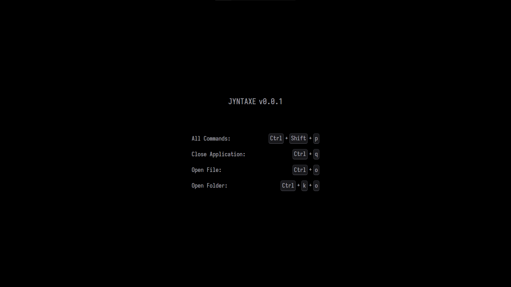
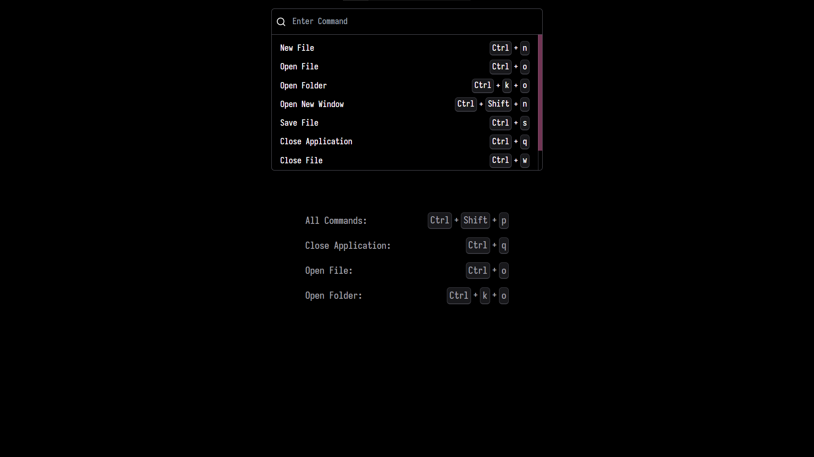
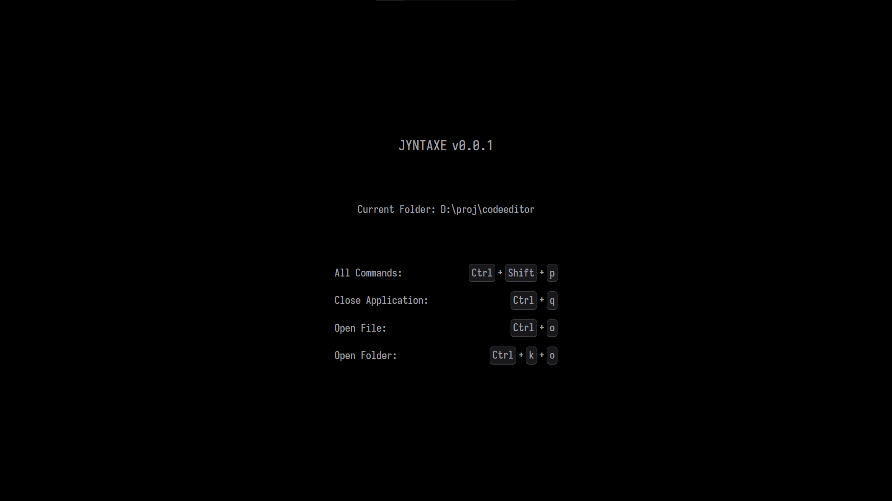
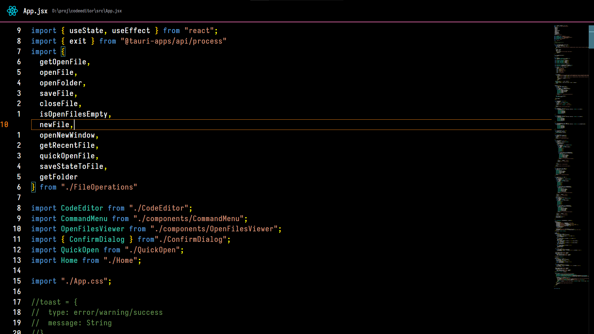
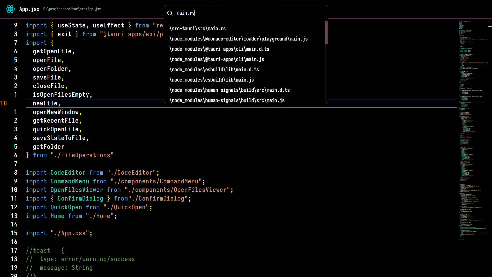
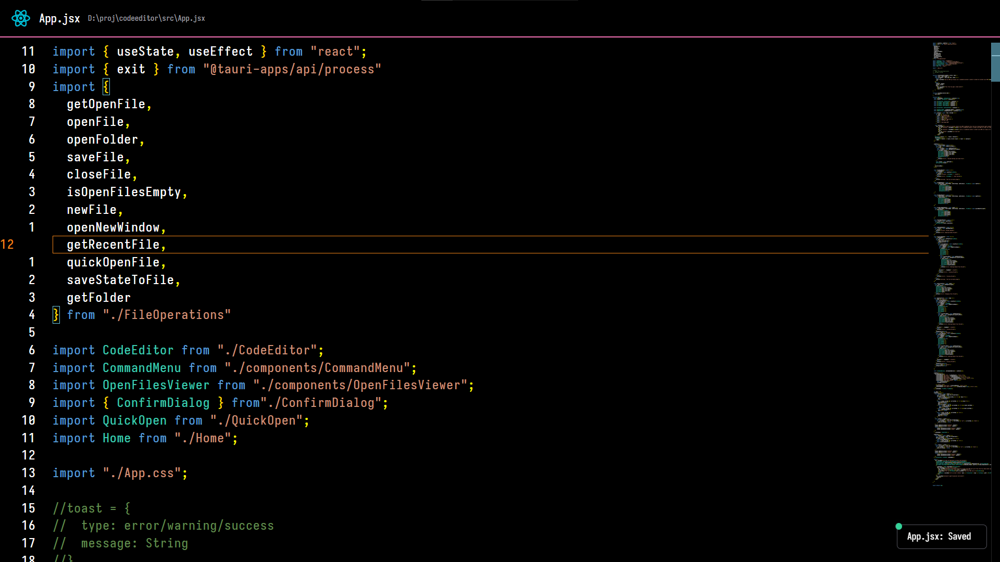
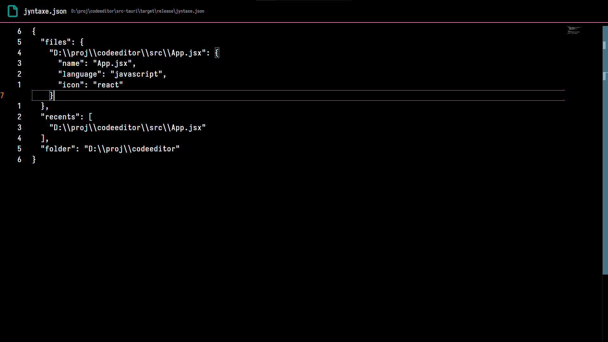

## JYNTAXE
___
A minimalist fullscreen code editor built using Tauri, React, Rust, and Tailwind CSS.
> **Note**: Only tested on Windows

### Features

- **Syntax Highlighting**: Supports baisc syntax highlighting for popular programming languages.
- **Fast and Responsive**: Utilizes Tauri for a native-like experience and React for a smooth UI.
- **Minimalist Design**: Focuses on simplicity and ease of use.
- **Navigation**: Navigation and Accesibilty is primarily through Key Bindings.

### Screen Shots

Home View


Commands


Folder Open {Slow for Direcotries with multiple Sub Directories}


File Open


Quick Open {Only Works When A folder is Open}


Toast Notifications


File Switcher {use <kbd>Alt</kbd>+<kbd>,</kbd> or <kbd>Alt</kbd>+<kbd>.</kbd>}


Stores the Last files an Folders Open for Next Time the App Executes.


### Installation:
**Dependencies**:
- Node
- Rust
- Tailwind CLI

Clone the Repository,
```bash
git clone https://github.com/JasnRathore/JYNTAXE.git
```
Change Directory,
```bash
cd JYNTAXE
```

Build The Executable,
```bash
npm run tauri build
```

> **Note**: Opening New window Wont work in dev mode

For Dev,
```bash
npm run tauri dev
```