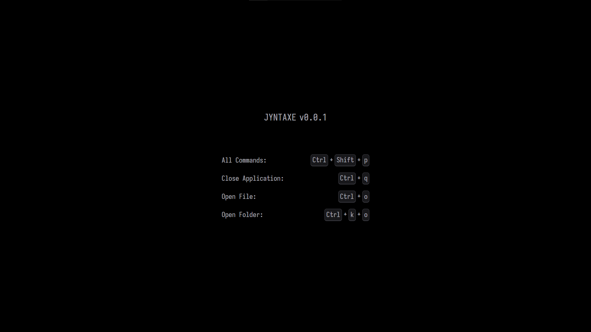
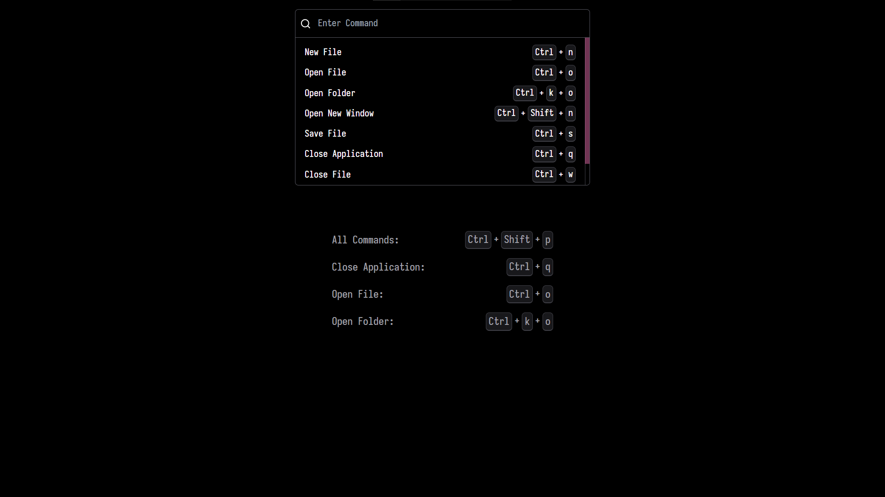
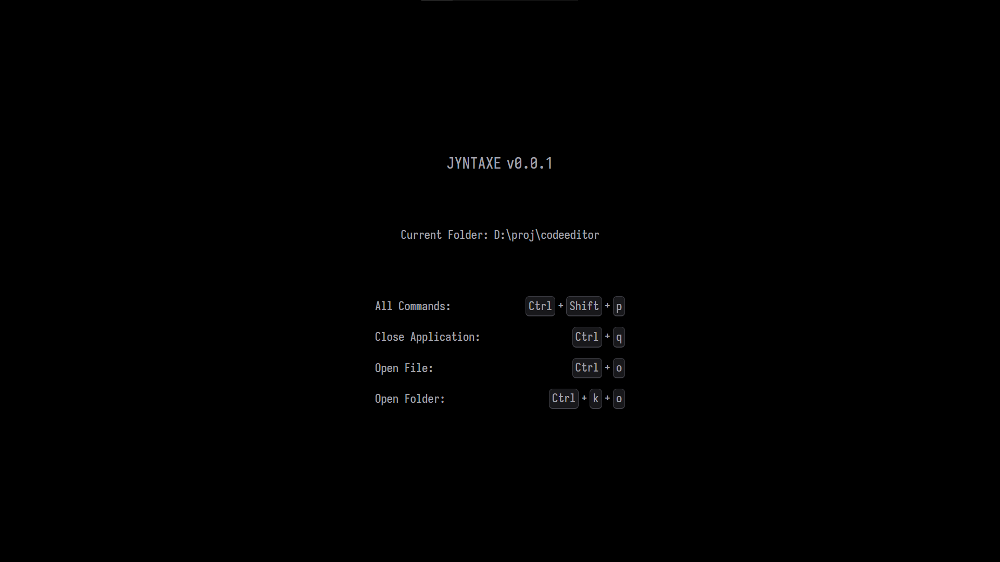
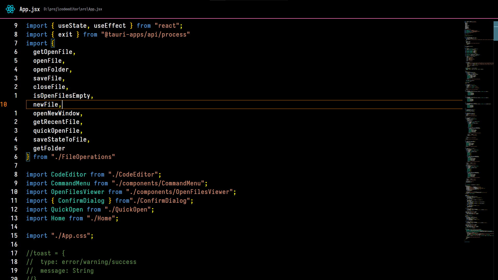
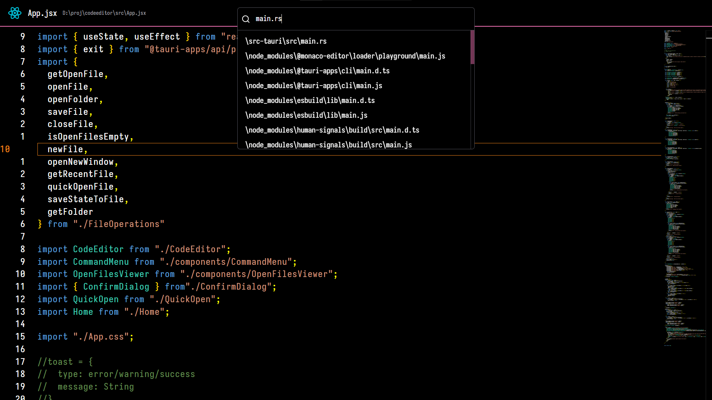
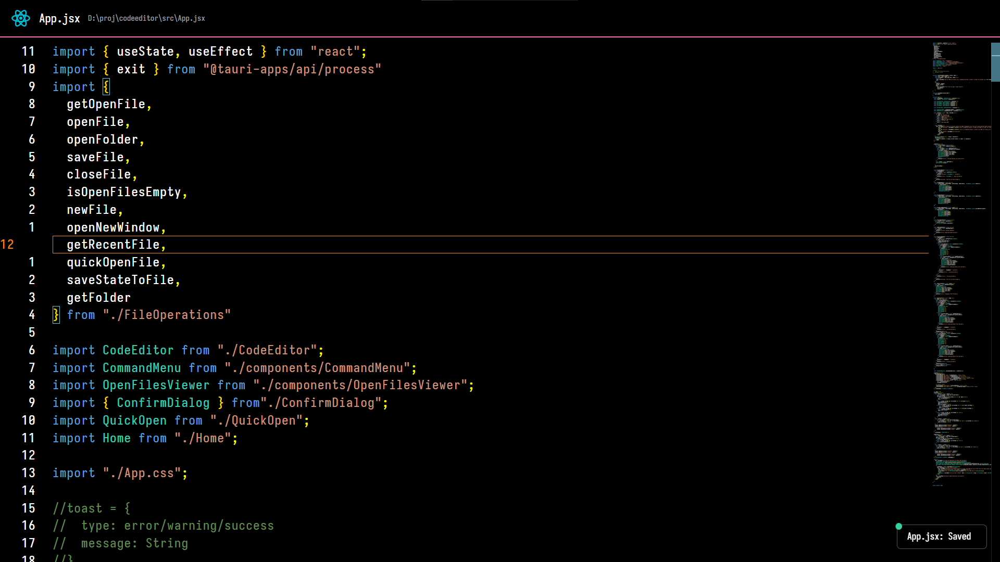
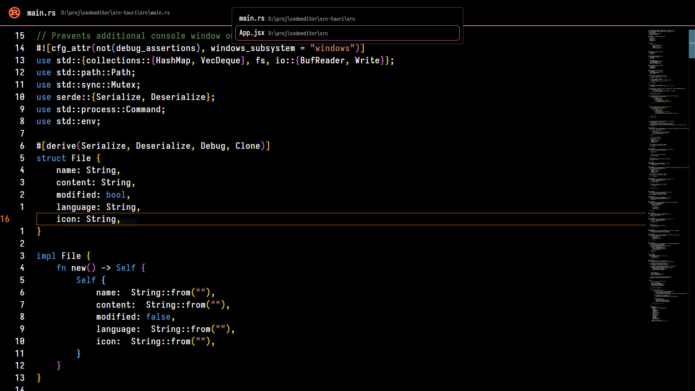
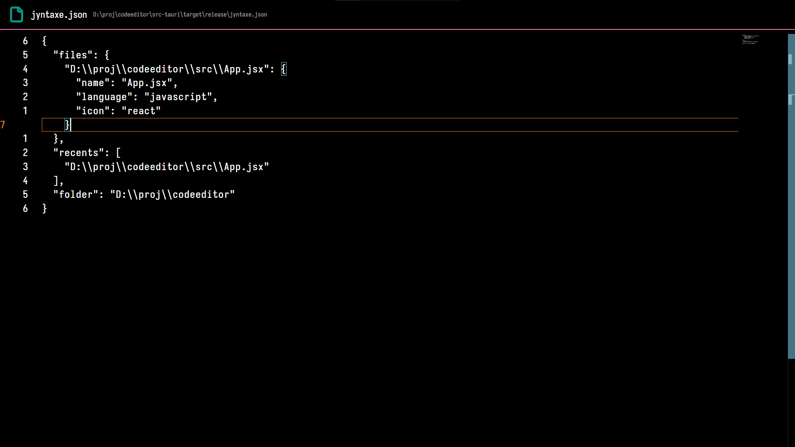

# JYNTAXE

> A minimalist, keyboard-first fullscreen code editor built with Tauri, React, Rust, and Tailwind CSS.

JYNTAXE is a lightweight desktop code editor designed for developers who prefer to keep their hands on the keyboard. It strips away the bloat of heavy IDEs in favor of a clean, distraction-free editing environment — syntax highlighting, fuzzy file search, multi-file management, and persistent session state all wrapped in a native-feel desktop app.

> **Note:** Currently tested and supported on Windows only.

---

## Why JYNTAXE?

Most editors ship with a mountain of features most developers never use. JYNTAXE takes the opposite approach: a focused, snappy editor that loads fast, stays out of the way, and remembers where you left off. It's built on [Tauri](https://tauri.app/) for a native binary footprint, Monaco for a battle-tested editing experience, and Rust for the file system layer — so the performance is real, not promised.

---

## Features

### Home View

The welcome screen greets you with the most essential keybindings so you're never left wondering how to get started.



---

### Command Palette

Every action in the editor is accessible via the command palette. No need to memorize every shortcut — just hit `Ctrl + Shift + P` and start typing.



---

### Open Folder

Load an entire project folder to unlock quick file search across your whole codebase. Note: deeply nested directories with many subdirectories may take a moment to index.



---

### Open File

Open any individual file directly via the native system dialog.



---

### Quick Open

With a folder loaded, `Ctrl + P` gives you a fuzzy search panel to jump to any file in your project instantly — no mouse required.



> Quick Open only works when a folder is currently open.

---

### Toast Notifications

Non-intrusive toast notifications keep you informed about save confirmations, errors, and other status events without interrupting your flow.



---

### File Switcher

Cycle through your open files without touching the mouse using `Alt + ,` (previous) and `Alt + .` (next).



---

### Persistent Session

JYNTAXE remembers your open files and active folder between sessions. Next time you launch, you're right back where you left off.



---

## Key Bindings

| Action             | Keybinding              |
|--------------------|-------------------------|
| All Commands       | `Ctrl + Shift + P`      |
| Open File          | `Ctrl + O`              |
| Open Folder        | `Ctrl + K` → `O`        |
| New File           | `Ctrl + N`              |
| Save File          | `Ctrl + S`              |
| Close File         | `Ctrl + W`              |
| Quick Open         | `Ctrl + P`              |
| Switch File (prev) | `Alt + ,`               |
| Switch File (next) | `Alt + .`               |
| New Window         | `Ctrl + Shift + N`      |
| Close Application  | `Ctrl + Q`              |

---

## Project Requirements

Before building or developing, make sure you have the following installed:

- **[Node.js](https://nodejs.org/)** (v18+ recommended)
- **[Rust](https://www.rust-lang.org/tools/install)** (stable toolchain via `rustup`)
- **[Tauri CLI prerequisites](https://tauri.app/v1/guides/getting-started/prerequisites)** — includes WebView2 on Windows
- **Tailwind CSS CLI** (used during the build step via PostCSS)

---

## Dependencies

### Frontend (`package.json`)

| Package | Role |
|---|---|
| `@monaco-editor/react` | Core editor component |
| `@tauri-apps/api` | Bridge to Tauri/Rust backend |
| `lucide-react` | Icon set |
| `tailwindcss` | Utility-first styling |
| `cmdk` | Command menu primitives |
| `@radix-ui/*` | Accessible UI primitives |

### Backend (`Cargo.toml`)

| Crate | Role |
|---|---|
| `tauri` | Desktop runtime and IPC |
| `serde` / `serde_json` | State serialization |
| `rust-fuzzy-search` | Fuzzy file name matching |

---

## Getting Started

Install Node dependencies:

```bash
npm install
```

Rust dependencies are resolved automatically by Cargo when you first build or run.

---

## Running the Application

### Development Mode

```bash
npm run tauri dev
```

This starts the Vite dev server on port `1420` and launches the Tauri window pointing at it. Hot-reload is active for the React frontend.

> **Heads up:** Opening a new window (`Ctrl + Shift + N`) won't work in dev mode — it relies on the compiled binary path. Use a production build for that feature.

### Production Build

```bash
npm run tauri build
```

This compiles the React frontend via Vite and bundles it into a native binary using Tauri. The output installer and executable will land in `src-tauri/target/release/bundle/`.

---

## Architecture Overview

JYNTAXE has a clean two-layer architecture:

```
┌──────────────────────────────────────┐
│         React Frontend (Vite)        │
│  Monaco Editor · CommandMenu ·       │
│  QuickOpen · OpenFilesViewer         │
└────────────────┬─────────────────────┘
                 │  invoke() / IPC
┌────────────────▼─────────────────────┐
│         Rust Backend (Tauri)         │
│  GlobalState (Mutex) · File I/O ·    │
│  Fuzzy Search · Session Persistence  │
└──────────────────────────────────────┘
```

The React layer calls Tauri commands via `invoke()` from `@tauri-apps/api`. The Rust side manages all file system operations and holds app state in thread-safe `Mutex`-wrapped structures.

### State Management (Rust)

The core state struct lives in `main.rs` and is shared across all Tauri commands:

```rust
struct GlobalState {
    files: Mutex<HashMap<String, File>>,  // path → file data
    recents: Mutex<VecDeque<String>>,     // most-recently-used order
    folder: Mutex<String>,                // active folder path
    folder_files: Mutex<Vec<String>>      // all files in active folder
}
```

When the app closes (`Ctrl + Q`), state is serialized to `jyntaxe.json` in the working directory. On next launch, this file is read back to restore open files, recents, and the active folder.

### Adding a New File Type

File type detection lives in `FileOperations.js`. To add support for a new extension, add a case to `getFileTypeIcon`:

```js
case "go":
  return ["go", "go"]  // [monaco language id, icon filename]
```

The first value maps to Monaco's language identifier. The second maps to an SVG icon in the `public/icons/` directory.

---

## Session Persistence

On startup, JYNTAXE reads `jyntaxe.json` (written alongside the executable) to restore your last working state. Here's what that file looks like:

```json
{
  "files": {
    "C:\\dev\\project\\main.rs": {
      "name": "main.rs",
      "language": "rust",
      "icon": "rust"
    }
  },
  "recents": ["C:\\dev\\project\\main.rs"],
  "folder": "C:\\dev\\project"
}
```

File contents are re-read from disk on restore, so you always get the latest version — not a stale cached snapshot.

---

## Project Structure

```
JYNTAXE/
├── src/                        # React frontend
│   ├── App.jsx                 # Root component, keybindings, state
│   ├── CodeEditor.jsx          # Monaco wrapper
│   ├── FileOperations.js       # Tauri IPC calls + file type detection
│   ├── QuickOpen.jsx           # Ctrl+P fuzzy file finder
│   ├── ConfirmDialog.jsx       # Unsaved changes prompt
│   ├── Home.jsx                # Welcome / landing screen
│   └── components/
│       ├── CommandMenu.jsx     # Ctrl+Shift+P palette
│       └── OpenFilesViewer.jsx # Alt+,/. file switcher
├── src-tauri/
│   ├── src/main.rs             # All Rust commands + GlobalState
│   ├── Cargo.toml
│   └── tauri.conf.json         # Window config, permissions, bundle
├── tailwind.config.js
└── vite.config.js
```

---

## Contributing

JYNTAXE is a focused side project — contributions that stay true to the minimalist philosophy are welcome. Fixing a bug or adding a file type? Open a PR. Proposing a larger feature? Open an issue first to discuss the direction.

---

## Wrapping Up

JYNTAXE shows how far you can get with Tauri + React when you focus on doing a few things well. The Rust backend delivers real file system performance, Monaco handles the hard parts of editing, and the keyboard-first design keeps the workflow fluid. Whether you're looking for a lighter tool between IDE sessions or studying a practical Tauri project, JYNTAXE is worth exploring. Feedback, issues, and contributions are all welcome.
